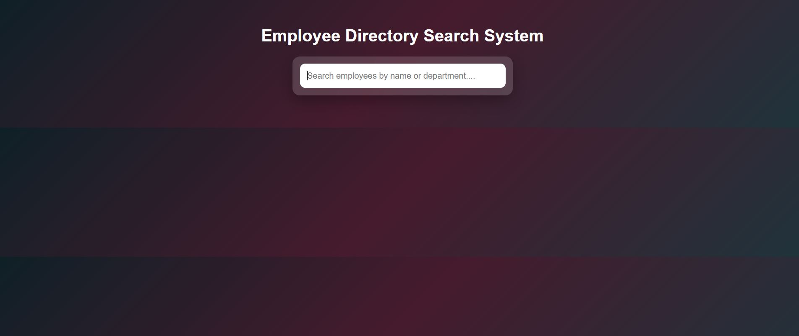
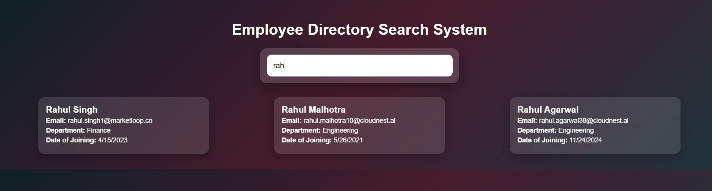
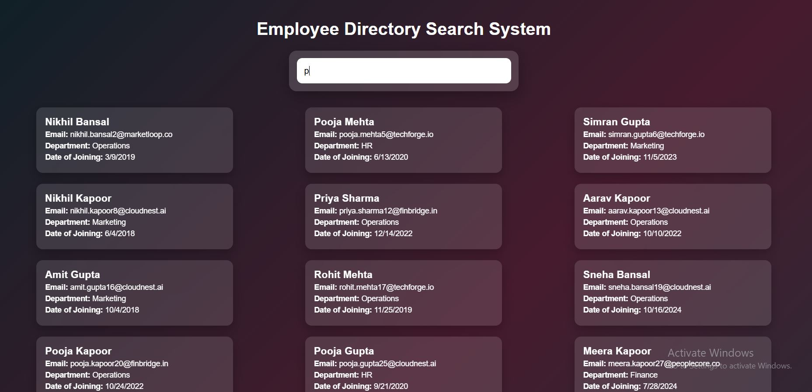
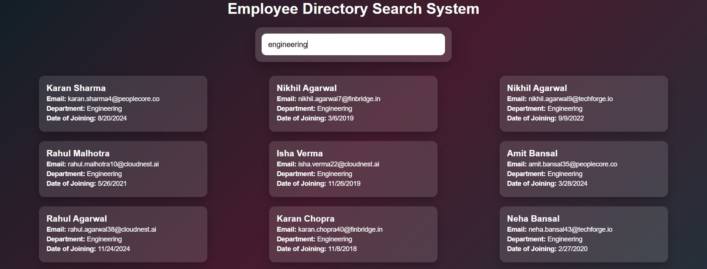

---

# Employee Directory System

---

## Introduction

This repository contains a full-stack Employee Directory application developed using **FastAPI**, **MySQL**, **Python** and **React**. The purpose of this project is to demonstrate practical backend architecture, frontend integration, and overall application design rather than focusing on excessive features.

The application allows users to search employee records by name or department and view the results in a structured grid layout. The project emphasizes clean code, maintainability, and clear separation of concerns between system layers.

This repository is intended to be readable and reusable by other developers in the future.

---

## Technology Stack

### Backend

* **FastAPI** – Used to build RESTful APIs
* **SQLAlchemy** – ORM used for database interaction
* **MySQL** – Relational database
* **Pydantic** – Data validation and serialization
* **python-dotenv** – Environment variable management

### Frontend

* **React (Vite)** – Frontend framework
* **JavaScript (ES6)** – Application logic
* **CSS** – Layout, styling, and animations

### Development Tools

* Git
* Node.js
* npm
* Python virtual environment

---
## System Requirements

To run this project locally, the following system requirements are recommended.

* Operating System

* Windows 10 or later

* macOS 12 or later

* Linux (Ubuntu 20.04+ recommended)

## Hardware

* Minimum 8 GB RAM (recommended for smooth MySQL and frontend runtime)

* Minimum 10 GB free disk space

## Software Requirements
### Backend

* Python 3.10 or later

* MySQL Server 8.0 or later

* pip (Python package manager)

### Frontend

* Node.js 18 or later

* npm 9 or later

### Tools

* Git

* Any modern web browser (Chrome, Edge, Firefox)

---

## Project Structure

```
Huzaifa-Zahid-Shah-Assignment/
│
├── backend/
│   ├── app/
│   │   ├── core/
│   │   │   └── database.py
│   │   ├── models/
│   │   │   └── employee.py
│   │   ├── repositories/
│   │   │   └── employee_repo.py
│   │   ├── services/
│   │   │   └── employee_service.py
│   │   ├── routers/
│   │   │   └── employee_router.py
│   │   └── main.py
│   │
│   ├── scripts/
│   │   └── seed_employees.py
│   │
│   ├── requirements.txt
│   └── .env.example
│
├── frontend/
│   ├── src/
│   │   ├── components/
│   │   │   ├── SearchBar.jsx
│   │   │   ├── EmployeeList.jsx
│   │   │   └── EmployeeCard.jsx
│   │   ├── services/
│   │   │   └── employeeApi.js
│   │   ├── App.jsx
│   │   ├── main.jsx
│   │   └── index.css
│   │
│   ├── package.json
│   └── vite.config.js
│
├── .gitignore
└── README.md
```

---

## Backend Design and Architecture

The backend is structured using a layered architecture to ensure clarity, scalability, and ease of maintenance.

### Database Layer

The database connection is configured in `database.py`. SQLAlchemy is used to manage connections and sessions. A shared base class is defined for all ORM models.

This approach ensures consistent database access throughout the application and allows dependency injection of database sessions into API routes.

---

### Model Layer

The `Employee` model defines the structure of the employees table. It includes fields such as name, email, department, designation, and date of joining.

Using ORM models allows schema validation, safer database queries, and reusability across the application, including scripts and API logic.

---

### Repository Layer

The repository layer is responsible only for interacting with the database. It contains functions that construct and execute SQLAlchemy queries.

No business logic or validation is performed here. This separation allows the data access logic to remain isolated and easily testable.

---

### Service Layer

The service layer acts as an intermediary between the API routes and the repository. It performs validation and applies business rules before interacting with the database.

For example, search input is validated before executing database queries. This keeps API routes clean and ensures consistent logic across the application.

---

### Router Layer

The router layer handles HTTP requests and responses. It extracts query parameters, injects dependencies, and returns JSON responses to the frontend.

All routes are grouped logically and registered in the main application file.

---

### Application Entry Point

The `main.py` file initializes the FastAPI application, registers routers, configures middleware, and creates database tables at startup if they do not already exist.

---

## Seed Script

The project includes a Python seed script that generates 50 realistic employee records.

This script:

* Uses ORM models
* Prevents duplicate inserts
* Generates meaningful test data
* Can be run multiple times safely

Seed scripts are intentionally kept outside the application code to avoid mixing runtime logic with development utilities.

---

## Frontend Design and Architecture

The frontend is built using React with a focus on simplicity and clarity.

### Application Flow

1. The user enters a search term.
2. The input value is controlled by React state.
3. A debounced effect triggers an API call.
4. The backend returns matching employees.
5. Results are rendered in a grid layout.

---

### Component Structure

* **SearchBar**
  Handles user input and passes the value to the parent component.

* **EmployeeList**
  Responsible for layout and rendering multiple employee cards.

* **EmployeeCard**
  Displays individual employee details in a structured format.

Each component has a single responsibility, making the UI easy to maintain and extend.

---

### Layout and Styling

CSS Grid is used to display employees in a three-column layout on larger screens. The layout adjusts automatically for smaller screen sizes.

Animations are implemented using basic CSS transitions to improve user experience without introducing external libraries.

---

## Installation and Setup

### Prerequisites

* Python 3.10 or higher
* Node.js 18 or higher
* MySQL 8.0 or higher
* Git

---

## Backend Setup

1. Navigate to the backend directory:

   ```bash
   cd backend
   ```

2. Create and activate a virtual environment:

   ```bash
   python -m venv venv
   ```

   Windows:

   ```bash
   venv\Scripts\activate
   ```

   macOS/Linux:

   ```bash
   source venv/bin/activate
   ```

3. Install dependencies:

   ```bash
   pip install -r requirements.txt
   ```

4. Configure environment variables:
   Create a `.env` file using `.env.example`.

5. Start the backend server:

   ```bash
   python -m uvicorn app.main:app --reload
   ```

---

## Database Seeding

To populate the database with sample data:

```bash
cd backend
python -m scripts.seed_employees
```

---

## Frontend Setup

1. Navigate to the frontend directory:

   ```bash
   cd frontend
   ```

2. Install dependencies:

   ```bash
   npm install
   ```

3. Start the development server:

   ```bash
   npm run dev
   ```

---

## Setup Steps

This project is structured so that both backend and frontend can be set up independently and run together.

### Backend Setup Summary

1. Clone the repository and navigate to the backend directory.

2. Create and activate a Python virtual environment.

3. Install backend dependencies from requirements.txt.

4. Configure database credentials using environment variables.

5. Start the FastAPI server using Uvicorn.

6. Seed the database with sample employee data.

7. Once started, the backend exposes a REST API on port 8000 which the frontend consumes.

### Frontend Setup Summary

1. Navigate to the frontend directory.

2. Install dependencies using npm.

3. Start the Vite development server.

4. The frontend runs on port 5173 and communicates with the backend using HTTP requests.

5. Both servers must be running simultaneously for the application to work correctly.

---

## How the System Works End-to-End

* The frontend captures user input.
* Requests are sent to the backend API.
* The backend processes the request through multiple layers.
* The database returns matching records.
* The frontend renders results in a structured layout.

---

## Application Screenshots
### Initial Search Interface

This view shows the application on initial load with the search input centered and ready for user interaction.

### Search by Employee Name

This example shows the results returned when searching by an employee’s name. Matching records are displayed in a three-column grid layout.





### Search by Department

This example demonstrates searching employees by department. The results dynamically update based on the query.



---

